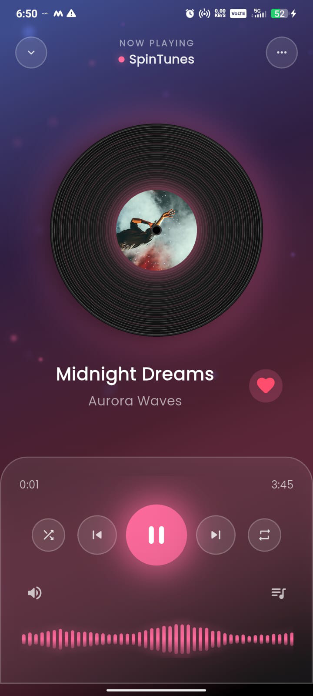

# 🎧 SpinTunes – Flutter Music Player UI

[](https://flutter.dev)
[](LICENSE)
[](#)
[](CONTRIBUTING.md)

SpinTunes is a beautifully crafted, fully animated **music player UI** built with Flutter. It showcases modern gradients, glassmorphism, smooth page transitions, and a vinyl-style now playing experience – perfect as a reference for music apps or as a starting point for your own player.

> 🚀 Designed & developed by **CH.srihari**

---

## ✨ Features

### 🎵 Home Screen
- Recently played section with smooth animations
- Curated playlists with stunning cover art
- Mini player docked at the bottom for quick access
- Seamless navigation between screens

### 🔍 Powerful Search
- Search by tracks, artists, albums, and playlists
- Category chips to filter results dynamically
- Smooth list/grid layouts for each content type
- Real-time search with instant results

### 📚 Library Management
- Organized tabs: Playlists, Artists, Albums, Favorites
- Glassmorphism cards with beautiful gradients and shadows
- Favorite tracks marked with heart indicator
- Easy access to all your music collections

### ▶️ Now Playing Screen
- Animated vinyl disc with rotating cover art
- Dynamic gradient background matching track theme
- Custom progress bar with smooth animations
- Professional waveform visualizer
- Full playback controls: Shuffle, Previous, Play/Pause, Next, Repeat
- "Up Next" queue with bottom sheet interface
- Song lyrics support (optional)

### 🎼 Playlists & Details
- Playlist detail page with hero artwork animation
- Complete track listings with duration
- Overflow menu for additional options
- "Play All" button with eye-catching glow effect
- Add/remove tracks functionality

### ⚙️ Settings & Preferences
- **Playback Settings**
    - High quality audio toggle
    - Audio quality slider (Low/Medium/High/Lossless)
    - Equalizer presets

- **Download Management**
    - Wi-Fi only downloads option
    - Storage location selection
    - Manage downloaded content

- **Notifications**
    - Push notification toggle
    - Now playing notifications

- **About & Legal**
    - Terms of Service
    - Privacy Policy
    - App version and build info
    - Open source licenses

### 🧱 Clean Architecture
- Separate models for tracks, albums, artists, playlists
- Provider-based state management (`MusicProvider`)
- Reusable widget components
- Modular and scalable codebase
- Easy to extend and customize

---

## 📸 Screenshots

### Home & Search
| Home Screen | Search Empty | Search Results |
|-------------|--------------|----------------|
|  |  |  |

| Search Playlists | Search Albums | Search Artists |
|------------------|---------------|----------------|
|  |  |  |

### Library & Settings
| Library Playlists | Library Favorites | Settings |
|-------------------|-------------------|----------|
|  |  |  |

### Now Playing Screens
| Midnight Dreams | Ocean Breeze | Neon Nights |
|-----------------|--------------|-------------|
|  |  |  |

| Electric Soul | Sunset Vibes | Starlight Drive |
|---------------|--------------|-----------------|
|  |  |  |

### Details & Queue
| Up Next Queue | Playlist Detail | Artist Detail |
|---------------|-----------------|---------------|
|  |  |  |

---

## 🛠 Tech Stack

| Category | Technology |
|----------|------------|
| **Framework** | Flutter 3.x |
| **Language** | Dart |
| **State Management** | Provider |
| **Routing** | go_router |
| **Image Loading** | cached_network_image |
| **UI Concepts** | Glassmorphism, Gradients, Hero Animations |
| **Custom Widgets** | Vinyl Disc, Waveform Visualizer, Progress Bar |

---

## 📂 Project Structure

```
lib/
│
├─ main.dart                      # App entry point
├─ main_scaffold.dart             # Main navigation scaffold
│
├─ models/                        # Data models
│  ├─ track_model.dart           # Track data structure
│  ├─ album_model.dart           # Album data structure
│  ├─ artist_model.dart          # Artist data structure
│  └─ playlist_model.dart        # Playlist data structure
│
├─ providers/                     # State management
│  └─ music_provider.dart        # Music playback & state
│
├─ screens/                       # App screens
│  ├─ home_screen.dart           # Home/discover page
│  ├─ search_screen.dart         # Search functionality
│  ├─ library_screen.dart        # User library
│  ├─ player_screen.dart         # Now playing screen
│  ├─ playlist_detail_screen.dart
│  ├─ album_detail_screen.dart
│  ├─ artist_detail_screen.dart
│  └─ settings_screen.dart       # App settings
│
└─ widgets/                       # Reusable components
   ├─ mini_player.dart           # Bottom mini player
   ├─ player_controls.dart       # Playback controls
   ├─ progress_bar.dart          # Custom progress bar
   ├─ waveform_visualizer.dart   # Audio waveform
   ├─ vinyl_disc.dart            # Animated vinyl disc
   ├─ track_list.dart            # Track list widget
   ├─ glass_card.dart            # Glassmorphism card
   └─ floating_particles.dart    # Particle effects
```

---

## 🚀 Getting Started

### Prerequisites

Before you begin, ensure you have the following installed:

- **Flutter SDK** (stable channel) - [Install Flutter](https://flutter.dev/docs/get-started/install)
- **Dart SDK** (comes with Flutter)
- **Android Studio** or **VS Code** with Flutter & Dart plugins
- **Git** for version control
- Android/iOS device or emulator (or Chrome for web testing)

### Installation

1. **Clone the repository**
   ```bash
   git clone https://github.com/srihari2479/SpinTunes.git
   cd SpinTunes
   ```

2. **Install dependencies**
   ```bash
   flutter pub get
   ```

3. **Verify Flutter installation**
   ```bash
   flutter doctor
   ```

4. **Run the app**
   ```bash
   # For Android/iOS
   flutter run

   # For web
   flutter run -d chrome

   # For specific device
   flutter run -d <device-id>
   ```

5. **Build for production**
   ```bash
   # Android APK
   flutter build apk --release

   # iOS
   flutter build ios --release

   # Web
   flutter build web --release
   ```

---

## 🧩 Customization Guide

### 1. Update Dummy Data
Replace the sample data in your provider/model files:

```dart
// In music_provider.dart or respective model files
final tracks = [
  Track(
    id: '1',
    title: 'Your Song Title',
    artist: 'Artist Name',
    album: 'Album Name',
    duration: Duration(minutes: 3, seconds: 45),
    coverUrl: 'https://your-image-url.com/cover.jpg',
  ),
  // Add more tracks...
];
```

### 2. Customize Theme Colors

```dart
// Update in main.dart or theme.dart
final primaryColor = Color(0xFF6366F1);
final secondaryColor = Color(0xFFEC4899);
final backgroundColor = Color(0xFF0F0F0F);
```

### 3. Modify Gradients

```dart
// In respective screen files
LinearGradient(
  colors: [
    Colors.purple,
    Colors.blue,
    Colors.pink,
  ],
  begin: Alignment.topLeft,
  end: Alignment.bottomRight,
)
```

### 4. Integrate Real Audio Backend

To add actual audio playback functionality:

```yaml
# Add to pubspec.yaml
dependencies:
  just_audio: ^0.9.36
  audio_service: ^0.18.12
```

```dart
// Implement in music_provider.dart
import 'package:just_audio/just_audio.dart';

class MusicProvider extends ChangeNotifier {
  final AudioPlayer _audioPlayer = AudioPlayer();
  
  Future<void> play(String url) async {
    await _audioPlayer.setUrl(url);
    await _audioPlayer.play();
  }
  // Add more playback methods...
}
```

### 5. Connect to API

```dart
// Create a service class
class MusicService {
  Future<List<Track>> fetchTracks() async {
    final response = await http.get(Uri.parse('your-api-url'));
    // Parse and return tracks
  }
}
```

---

## 📱 Features Roadmap

- [ ] Real audio playback integration
- [ ] Offline download support
- [ ] Social sharing features
- [ ] User authentication
- [ ] Cloud sync for playlists
- [ ] Lyrics integration
- [ ] Sleep timer
- [ ] Crossfade between tracks
- [ ] Equalizer with presets
- [ ] Dark/Light theme toggle
- [ ] Chromecast support

---

## 🤝 Contributing

Contributions, issues, and feature requests are welcome! Feel free to check the [issues page](https://github.com/srihari2479/SpinTunes/issues).

### How to Contribute

1. **Fork the repository**
2. **Create a new branch**
   ```bash
   git checkout -b feature/my-awesome-feature
   ```
3. **Make your changes**
4. **Commit your changes**
   ```bash
   git commit -m "Add some awesome feature"
   ```
5. **Push to the branch**
   ```bash
   git push origin feature/my-awesome-feature
   ```
6. **Open a Pull Request**

### Contribution Guidelines

- Follow Flutter/Dart best practices
- Maintain consistent code style
- Add comments for complex logic
- Update documentation as needed
- Test your changes thoroughly

---

## 🐛 Bug Reports

Found a bug? Please open an issue with:
- Clear description of the problem
- Steps to reproduce
- Expected vs actual behavior
- Screenshots (if applicable)
- Device/platform information

---

## 📄 License

This project is licensed under the **MIT License** - see the [LICENSE](LICENSE) file for details.

```
MIT License

Copyright (c) 2025 CH.srihari

Permission is hereby granted, free of charge, to any person obtaining a copy
of this software and associated documentation files (the "Software"), to deal
in the Software without restriction, including without limitation the rights
to use, copy, modify, merge, publish, distribute, sublicense, and/or sell
copies of the Software, and to permit persons to whom the Software is
furnished to do so, subject to the following conditions:

The above copyright notice and this permission notice shall be included in all
copies or substantial portions of the Software.

THE SOFTWARE IS PROVIDED "AS IS", WITHOUT WARRANTY OF ANY KIND, EXPRESS OR
IMPLIED, INCLUDING BUT NOT LIMITED TO THE WARRANTIES OF MERCHANTABILITY,
FITNESS FOR A PARTICULAR PURPOSE AND NONINFRINGEMENT.
```

---

## 👨‍💻 Author

**CH.srihari**  
Flutter Developer | UI/UX Enthusiast | Full-Stack Developer

- 📧 Email: sriharichoppa12@gmail.com
- 💼 LinkedIn: [linkedin.com/in/srihari-choppa](https://www.linkedin.com/in/srihari-choppa/)

---

## 🙏 Acknowledgments

- Flutter team for the amazing framework
- All contributors and testers
- Design inspiration from Spotify, Apple Music, and YouTube Music
- Icons from [Feather Icons](https://feathericons.com/)
- Fonts from [Google Fonts](https://fonts.google.com/)

---

## ⭐ Show Your Support

If you found SpinTunes helpful or learned something from it:

- Give the repository a ⭐ on GitHub
- Share it with fellow developers
- Follow for more Flutter projects
- Consider sponsoring the development

---

## 📞 Contact & Support

Have questions or need help?

- Open an [issue](https://github.com/srihari2479/SpinTunes/issues)
- Start a [discussion](https://github.com/srihari2479/SpinTunes/discussions)
- Reach out via email

---

<div align="center">

**Made with ❤️ and Flutter**

[Report Bug](https://github.com/srihari2479/SpinTunes/issues) · [Request Feature](https://github.com/srihari2479/SpinTunes/issues) · [Documentation](https://github.com/srihari2479/SpinTunes/wiki)

</div>